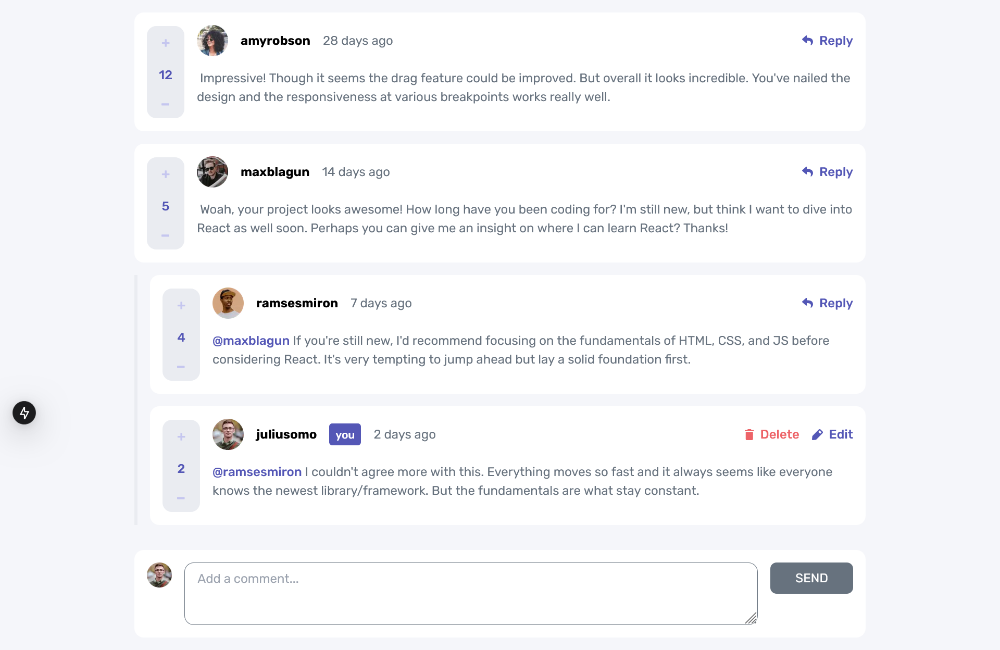
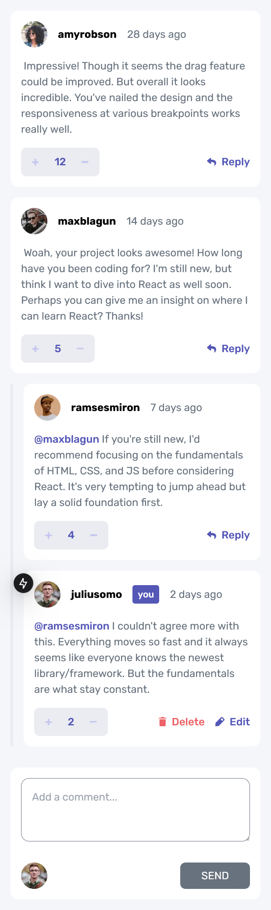

# Frontend Mentor - Interactive Comments Section solution

This is a solution to the
[Interactive comments section challenge on Frontend Mentor](https://www.frontendmentor.io/challenges/interactive-comments-section-iG1RugEG9).
Frontend Mentor challenges help you improve your coding skills by building realistic projects.

## Table of contents

- [Overview](#overview)
    - [The challenge](#the-challenge)
    - [Screenshot](#screenshot)
    - [Links](#links)
- [My process](#my-process)
    - [Built with](#built-with)
    - [What I learned](#what-i-learned)
    - [Continued development](#continued-development)
    - [Useful resources](#useful-resources)
- [Author](#author)

**Note: Delete this note and update the table of contents based on what sections you keep.**

## Overview

### The challenge

Users should be able to:

- View the optimal layout for the app depending on their device's screen size
- See hover states for all interactive elements on the page
- Create, Read, Update, and Delete comments and replies
- Upvote and downvote comments
- **Bonus**: If you're building a purely front-end project, use `localStorage` to save the current state in the browser
  that persists when the browser is refreshed.
- **Bonus**: Instead of using the `createdAt` strings from the `data.json` file, try using timestamps and dynamically
  track the time since the comment or reply was posted.

### Screenshot

#### Desktop

#### Mobile

### Links

- Solution URL: Not posted to Frontend Mentor yet
- Live Site URL: https://interactive-comments-section-beryl.vercel.app/

## My process

### Built with

- Semantic HTML5 markup
- Flexbox
- Mobile-first workflow
- [React](https://reactjs.org/) - JS library
- [Next.js](https://nextjs.org/) - React framework
- [TailwindCSS](https://tailwindcss.com/) - For styles

### What I learned

Not added yet

### Continued development

Not added yet

### Useful resources

Not added yet

## Author

- Frontend Mentor - [@Mirror83](https://www.frontendmentor.io/profile/yourusername)
- Twitter - [@glen_ochieng_](https://www.twitter.com/glen_ochieng_)
